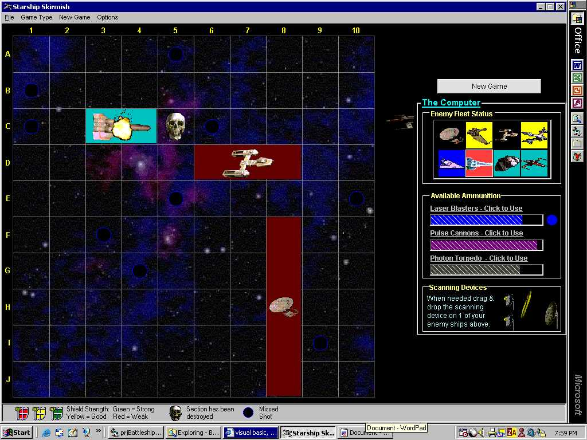



## LaVolpe Starship Skirmish \(Pt 1\)

### Description

Updated. Game--Battleship in space. A few twists on the original battleship like shields, scanning devices, cloaking. Play against another person or computer. A speed-play Salvo game option also. Built for my son, he thought it was awesome. Maybe yours would like it too.  

This update enables computer as opponent in all the games now.  

Part II has the optional WAV files (too big for one posting). Get Part II at http://www.planet-source-code.com/vb/scripts/ShowCode.asp?txtCodeId=40635&lngWId=1
 
### More Info
 

             |
---                |---
**Submitted On**   |2002-11-16 23:07:08
**By**             |[LaVolpe](https://github.com/Planet-Source-Code/PSCIndex/blob/master/ByAuthor/lavolpe.md)
**Level**          |Advanced
**User Rating**    |4.8 (24 globes from 5 users)
**Compatibility**  |VB 6\.0
**Category**       |[Games](https://github.com/Planet-Source-Code/PSCIndex/blob/master/ByCategory/games__1-38.md)
**World**          |[Visual Basic](https://github.com/Planet-Source-Code/PSCIndex/blob/master/ByWorld/visual-basic.md)
**Archive File**   |[LaVolpe\_St14986111172002\.zip](https://github.com/Planet-Source-Code/lavolpe-lavolpe-starship-skirmish-pt-1__1-40787/archive/master.zip)

